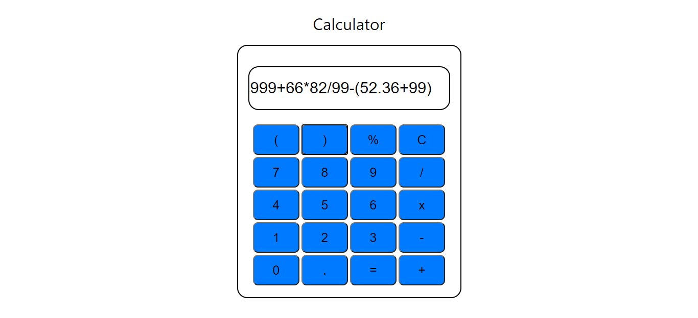

# Calculator
```
  A basic level JS Calculator
```
This isn't the _Perfect_ calculator but it can do the basic operations used in general.



>A thing noticed in this is that it doesn't clear out the screen until and unless pressed the **C** key. It will add up the latest input if not pressed that key.
